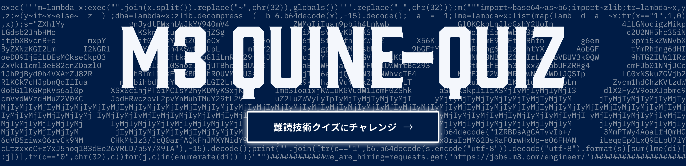

# Crazy Programming

## Description

実行するとソースコード自身と同じ文字列が返ってくるコード「Quine」、社内で開発された「プログラミングクイズ」を掲載しています。
社内Slackにおけるプログラミングの雑学を共有するチャンネル `#crazy-programming` より命名されたリポジトリです。

## Quine

|lang|title(link)|
|---|---|
|Python|[M3 Python Quine](https://github.com/m3-inc-personal/crazy_programming/tree/main/quine/python)|
|Python|[出力が動くFukuoka採用Quine](https://github.com/m3-inc-personal/crazy_programming/tree/main/quine/python)|
|Scala|[M3 Scala Quine](https://github.com/m3-inc-personal/crazy_programming/tree/main/quine/scala)|
|OCaml|[M3 OCaml Quine](https://github.com/m3-inc-personal/crazy_programming/tree/main/quine/ocaml)|

## Programming Quiz

Python Quiz Table

|title(link)|code|
|---|---|
|[Is Face Mark?](https://github.com/m3-inc-personal/crazy_programming/tree/main/quiz/python/is_face_mark)|`(d >_< b) if (c:=('ω')<"hi") else (c^0^c)-~3`|
|[While trick](https://github.com/m3-inc-personal/crazy_programming/tree/main/quiz/python/while_trick)|`[1,2,3,4];while _:_,*_=_;_`|
|[Slice list](https://github.com/m3-inc-personal/crazy_programming/tree/main/quiz/python/slice_list)|`[x:=1,x:=-~x,-~x][:][::-1][:1]`|
|[Slice hint](https://github.com/m3-inc-personal/crazy_programming/tree/main/quiz/python/slice_hint)|`_:...=[];_[:]:...=f'{f"{[...][::][0]}"::^0}';_`|
|[Long addition](https://github.com/m3-inc-personal/crazy_programming/tree/main/quiz/python/long_addition)|`0+~-~-~-~-~-~-~-~-~-~0`|
|[Numpy long addition](https://github.com/m3-inc-personal/crazy_programming/tree/main/quiz/python/numpy_long_addition)|`import numpy as np;x = np.arange(3);x-+~--~+-~~++~+-x;`|
|[Numpy array to array](https://github.com/m3-inc-personal/crazy_programming/tree/main/quiz/python/numpy_array_to_array)|`import numpy as np;print(np.zeros(((_:=1),_))[[(((~-_,),),)],(...)])`|
|[Numpy sum](https://github.com/m3-inc-personal/crazy_programming/tree/main/quiz/python/numpy_sum)|`import numpy as np;print(sum([sum:=-1],np.sum([sum],sum)))`|
|[Sum trick](https://github.com/m3-inc-personal/crazy_programming/tree/main/quiz/python/sum_trick)|`sum(((1,(2,(3),),(4,)),(5,),),())`|
|[Zeros](https://github.com/m3-inc-personal/crazy_programming/tree/main/quiz/python/zeros)||`000_0&00^00-0x0_0_00^0o0_00-~0^-0b0_0_0`|
|[To int](https://github.com/m3-inc-personal/crazy_programming/tree/main/quiz/python/to_int)|`int("%s_0%%s"%0x0%10)`|
|[Equals](https://github.com/m3-inc-personal/crazy_programming/tree/main/quiz/python/equals)|`f"{'='=}={'='=}"`|
|[Method chaining](https://github.com/m3-inc-personal/crazy_programming/tree/main/quiz/python/method_chaining)|`().__iter__().__class__.__name__[_:=-2]+[].__class__.__name__[_]`|
|[GeeK split](https://github.com/m3-inc-personal/crazy_programming/tree/main/quiz/python/geek_split)|`"g_e_e_k".split(_:="_",_:=len(_))[_].split(_:="_",_:=len(_))[_].split(_:="_")[len(_)]+"p"`|

Ruby Quiz Table

|title(link)|code|
|---|---|
|[RubyKaigi 2019 Day1-1](https://github.com/m3-inc-personal/crazy_programming/tree/main/quiz/ruby/ruby_kaigi_2019)|`!????!:!?!`|
|[RubyKaigi 2019 Day2-1](https://github.com/m3-inc-personal/crazy_programming/tree/main/quiz/ruby/ruby_kaigi_2019)|`%%%%%%..%%[0].size[0]`|
|[RubyKaigi 2019 Day2-1](https://github.com/m3-inc-personal/crazy_programming/tree/main/quiz/ruby/ruby_kaigi_2019)|`puts=:puts;puts=send(puts,puts)\|\|puts(puts){puts="puts"};puts`|
|[RubyKaigi 2019 Day2-2](https://github.com/m3-inc-personal/crazy_programming/tree/main/quiz/ruby/ruby_kaigi_2019)|`%%%%%%%%?????:??`|
|[RubyKaigi 2019 Day2-3](https://github.com/m3-inc-personal/crazy_programming/tree/main/quiz/ruby/ruby_kaigi_2019)|`a=0.0/0;a==a?a:irb.quit`|

# We are hiring!!

ギークな学びが大好きな皆さん、エムスリーで一緒に働いてみませんか？

私達のミッションは、インターネットを活用し、健康で楽しく長生きする人を１人でも増やし、不必要な医療コストを１円でも減らすこと。
エンジニアリングの力を活かし、共に医療の課題解決に向かう仲間を募集しています。

## エンジニア採用ページはこちら

[https://jobs.m3.com/engineer/](https://jobs.m3.com/engineer/)

## 新卒採用、インターンも常時募集しています

[https://fresh.m3recruit.com/engineer](https://fresh.m3recruit.com/engineer)
